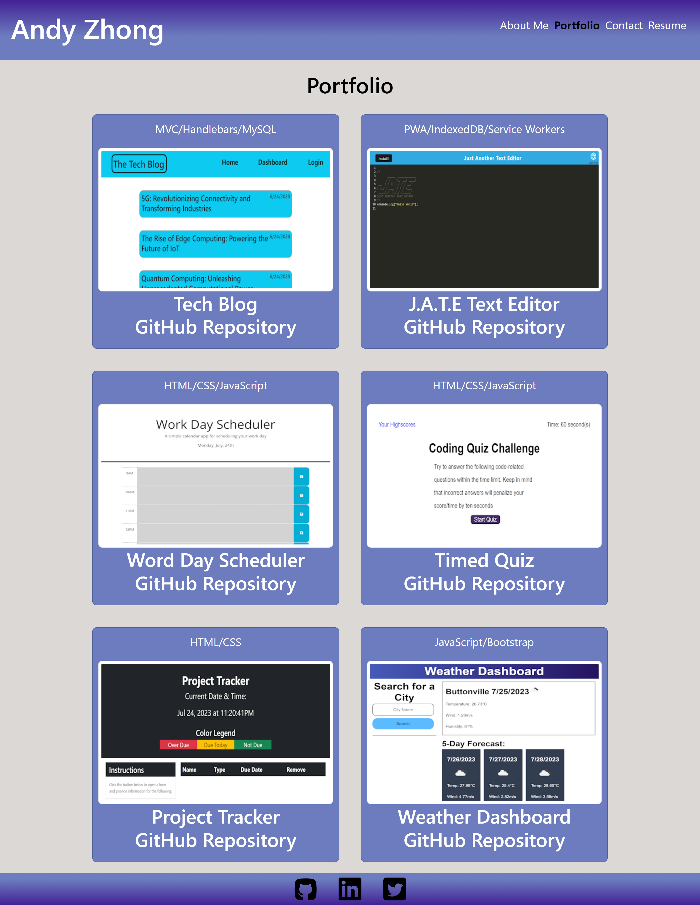
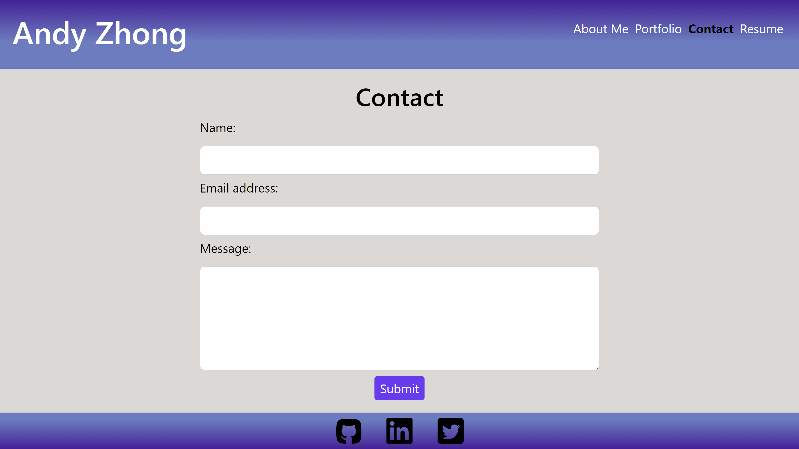
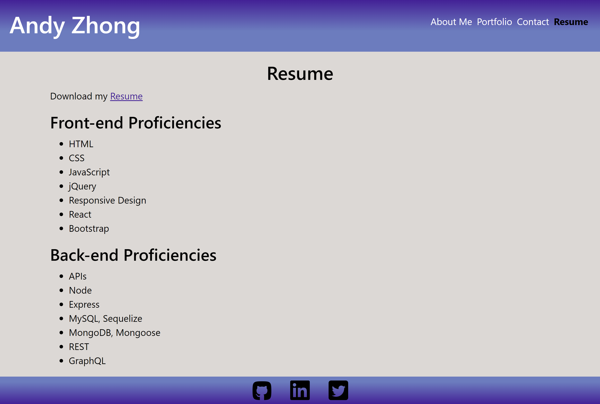

# React Portfolio

## Description

This project leverages the power of React and utilizes the gh-pages library for seamless deployment on GitHub Pages. By implementing advanced React techniques, it showcases the creation of a multi-page web application without the need for page refreshing upon navigation. Moreover, this endeavor has provided valuable insights into the process of deploying a React frontend effectively onto GitHub Pages.

## Installation

1. Clone the repository to your local machine using Git or download the source code as a ZIP file.

2. Navigate to the project directory in your terminal or command prompt.

3. Run the following command to install the required dependencies:

```
   npm install
```

4. After the installation is complete, start the local server by running:

```
   npm start
```

5. Once the local server is up and running, you can access and interact with the React frontend in your local environment. The application will be available at http://localhost:3000/ in your web browser.

## Usage

The landing page features an "About Me" section, and upon clicking the navigation titles, the displayed content dynamically changes without the need for page reloading. This ensures a seamless and smooth user experience throughout the website.






Deployed URL: https://timebytes.github.io/React-Portfolio/  
GitHub Repo: https://github.com/TimeBytes/React-Portfolio

## Credits

Used University of Toronto Bootcamp mock up as reference  
https://utoronto.bootcampcontent.com/utoronto-bootcamp/UTOR-VIRT-FSF-PT-02-2023-U-LOLC/-/tree/main/20-React/02-Challenge

## License

MIT License
